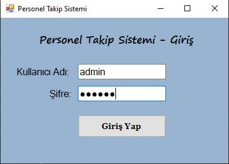
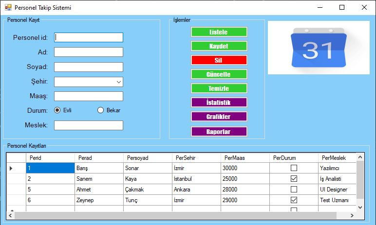
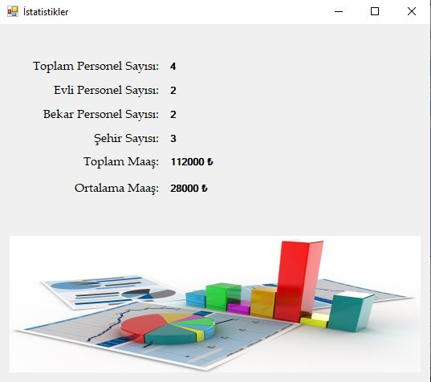
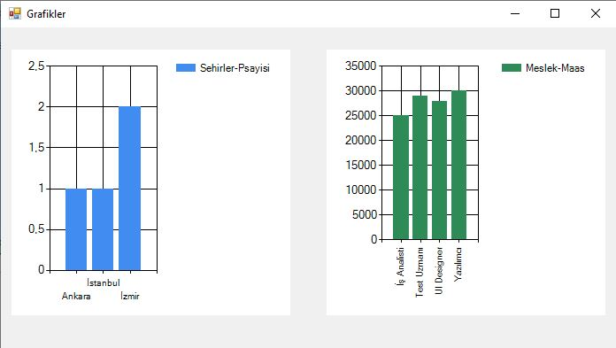

<h1>Personnel Tracking System</h1>

It is a desktop personnel tracking application developed in C#, MsSQL was used as the database. That includes all CRUD operations. 
   Data about personnel can be easily viewed through graphs and personnel can be tracked.  

<h2>Images</h2>

    

    

       

    

    

   
